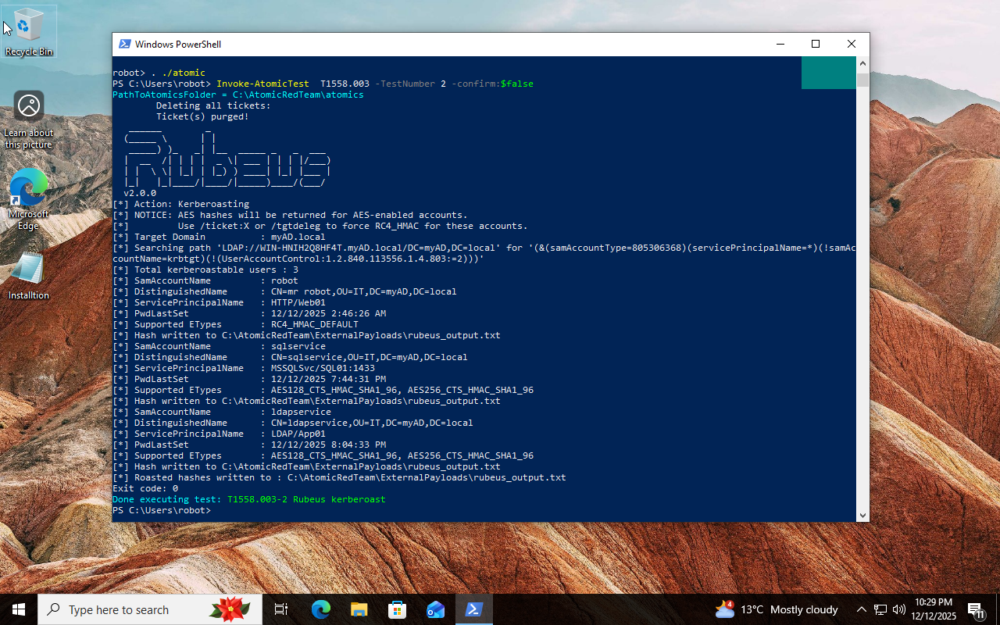
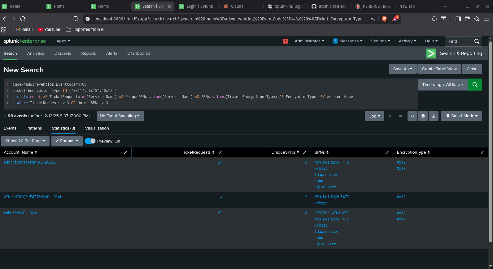
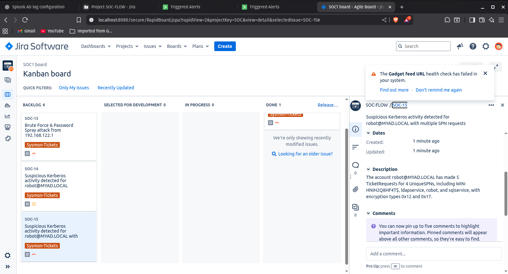

# T1558.003 - Kerberoasting

> **MITRE ATT&CK Technique:** Steal  Kerberos Tickets: Kerberoasting

This attack focuses on **Kerberos ticket generation** to extract service account credentials.

---

### Atomic Red Team
```powershell
Invoke-AtomicTest T1558.003 -TestNumbers 2 -Confirm:$false
```

**How it works:** Uses Rubeus kerberoast To extract all the SPN on the AD and then Generated the encrypted data of TGS which conains metadata like service name etc BUT MORE IMPORTANTLY service Password



---

### SPL for detection

**Purpose:** Detect Kerberos ticket generation attempts
```spl
index=adwineventlog EventCode=4769 
Ticket_Encryption_Type IN ("0x11","0x12","0x17")
| stats count AS TicketRequests dc(Service_Name) AS UniqueSPNs values(Service_Name) AS SPNs values(Ticket_Encryption_Type) AS EncryptionType  BY Account_Name
| where TicketRequests > 3 OR UniqueSPNs > 3
```

**Purpose:** Detect and Generate Alert Kerberos ticket generation attempts specially for weak and Encryption Type
```spl
index=adwineventlog EventCode=4769 
Ticket_Encryption_Type IN ("0x11","0x17") earliest=-5m latest=now
| stats count AS TicketRequests dc(Service_Name) AS UniqueSPNs values(Service_Name) AS SPNs values(Ticket_Encryption_Type) AS EncryptionType  BY Account_Name
| where TicketRequests > 3 OR UniqueSPNs > 3
```



---
### Jira ticket
