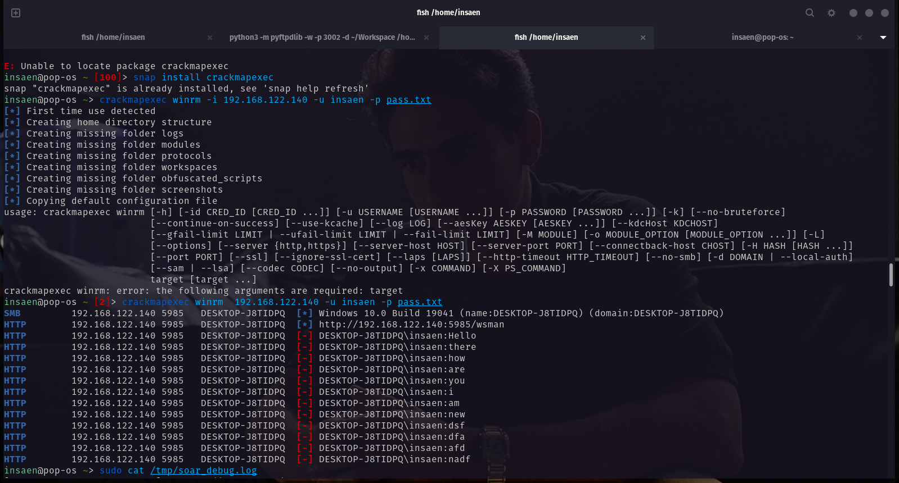
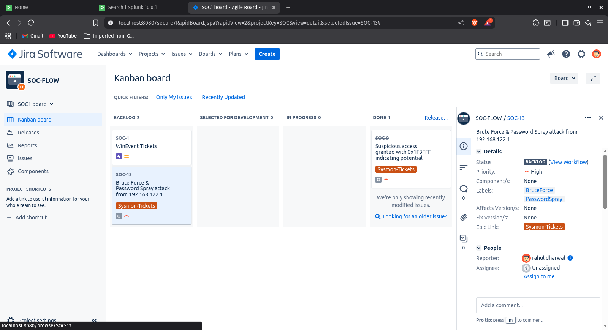

# Pre-Access Attacks
This document details attack techniques executed during the **Initial Access** phase, specifically focusing on authentication attacks against exposed services.

## Prerequisites
*   **Attacker**: Linux (Pop!_OS) with `crackmapexec` installed.
*   **Target**: Windows 10 with WinRM enabled (Port 5985).
*   **Logging**: Windows Security Event Logs enabled (Logon/Logoff).
*   **Reference**: See [Setup.md](Setup.md) for environment configuration.

---

## Scenario 1: WinRM Brute Force

### 1. Objective
Attempt to guess valid credentials for a specific user (e.g., `insaen`) by trying multiple passwords against the exposed WinRM service.

### 2. Attack Execution
We use `crackmapexec` to perform the brute force attack.

```bash
# pass.txt is a file containing 12 passwords (random and wrong)
# -u: Target username
# -p: Path to password list
crackmapexec winrm 192.168.122.140 -u insaen -p pass.txt
```

**Expected Output:**


### 3. Detection (Splunk)
**Data Source**: `WinEventLogs:Security`
**Event ID**: `4625` (An account failed to log on)

**SPL Query:**
```splunk
index=window10 EventCode=4625
| stats count AS failed_login_attempts,dc(Account_Name) As Distinct_Users, values(Account_Name) AS attempted_users by Source_Network_Address
| eval Attack_Type=case(
    failed_login_attempts > 10 AND Distinct_Users > 5 ,"Brute Force & Password Spray",
    failed_login_attempts > 10, "Brute Force",
    Distinct_Users > 5, "Password Spray",
    true(), "Suspicious Login"
)
| where failed_login_attempts > 10 OR Distinct_Users > 5
| sort - failed_login_attempts
```

**Query Explanation:**
*   `EventCode=4625`: Filters for failed logon events.
*   `stats count ...`: Aggregates the number of failures by the source IP.
*   `where failed_login_attempts > 10`: Filters for high-volume failures typical of automated attacks.


---

## Scenario 2: Password Spraying

### 1. Objective
To avoid account lockouts, an attacker tries **one** common password against **many** different usernames.

### 2. Attack Execution
```bash
# users.txt contains a list of valid/guessed usernames
# 'Summer2023!' is the single password being sprayed
crackmapexec winrm 192.168.122.140 -u users.txt -p 'Summer2023!'
```

### 3. Detection (Splunk)
Detects a single source attempting to login to multiple *different* accounts with failures.

```splunk
index=window10 EventCode=4625
| stats count AS failed_login_attempts,dc(Account_Name) As Distinct_Users, values(Account_Name) AS attempted_users by Source_Network_Address
| eval Attack_Type=case(
    failed_login_attempts > 10 AND Distinct_Users > 5 ,"Brute Force & Password Spray",
    failed_login_attempts > 10, "Brute Force",
    Distinct_Users > 5, "Password Spray",
    true(), "Suspicious Login"
)
| where failed_login_attempts > 10 OR Distinct_Users > 5
| sort - failed_login_attempts
```

**Visual:**


**jira Ticket Creation**



### 4. Mitigation
*   **Account Lockout Policy**: Enforce account lockouts after 3-5 failed attempts.
*   **Strong Passwords**: Use long, complex passwords.
*   **Network Segmentation**: Restrict WinRM access to management subnets only.
